# RF Signal Classification with Neural Networks

Multi-label classification of overlapping wireless signals from impaired RF inputs using neural networks in MATLAB, without any external ML frameworks.

Two complete experiments are included: one that synthesizes its own training data from scratch, and one that trains on real 3GPP-standard signals from the RFSS dataset. Both can classify multiple co-channel signals simultaneously (e.g. WLAN *and* LTE present at the same time along with real world impairments), a task that single-label classifiers are incapable of doing.

---

## Complexity of Signal Classification:

Standard RF classification benchmarks (like RadioML) hand you clean, single-signal captures at a known SNR. But the real spectrum doesn't work that way. In practice, you're dealing with:

- **Overlapping signals** - WLAN, LTE, and 5G share spectrum. Multiple standards can be active in the same channel simultaneously.
- **Hardware impairments** - Every transmitter and receiver introduces distortion: power amplifier clipping, oscillator phase noise, carrier frequency offsets.
- **Multipath fading** - Signals bounce off buildings, arrive at the antenna through multiple delayed paths, and interfere with themselves.
- **Variable SNR** - The classifier needs to work at 0 dB (i.e, a signal buried in noise) and 30 dB (i.e, nearly clean) without being tuned for a specific operating point.

Both experiments are designed so the network cannot take shortcuts. In Experiment 1, each signal's bandwidth is randomized across overlapping ranges: WLAN, LTE, and 5G all share the 5–14 MHz region, this means the model is forced to learn structural features rather than just measuring bandwidth.

---

## Project Structure

```
.
├── README.md
├── binaryCrossEntropyLayer.m       # Custom multi-label output layer (sigmoid + BCE fused) — shared by both experiments
├── Experiment 1/                   # Synthetically generated data
│   ├── run_full_experiment.m       # Entry point
│   ├── generate_modulations.m      # Synthesizes WLAN / LTE / 5G / Interferer baseband signals
│   ├── apply_rf_impairments.m      # Full channel simulation pipeline (PA → Rayleigh → Phase Noise → CFO → AWGN)
│   └── train_hybrid_network.m      # 1D-CNN architecture definition
├── Experiment 2/                   # Real imported RFSS data
│   ├── run_rfss_experiment.m       # Entry point
│   └── trained_rf_classifier_*.mat # Saved trained models from prior runs
├── assets/                         # README images and impairment/OFDM animations
└── data/
    └── rfss_single.h5              # (Experiment 2 only → download separately, see below for further details)
```

---

## Requirements

| Toolbox | Experiment 1 | Experiment 2 |
|---|:---:|:---:|
| MATLAB R2021b+ | Yes | Yes |
| Deep Learning Toolbox | Yes | Yes |
| Signal Processing Toolbox | Yes | Yes |
| Communications Toolbox | Yes | No |
| Parallel Computing Toolbox | Yes | No |
| Image Processing Toolbox | No | Yes |

The `OutputNetwork: 'best-validation-loss'` training option requires R2021b or later.

---

## Experiment 1 : Synthetic Signals

### What it does

Generates a fully synthetic dataset of overlapping OFDM signals, extracts a physically motivated feature, and trains a compact 1D-CNN to classify which combination of standards is present.

### Signal Generation

Three signal types are synthesized in `generate_modulations.m`:

| Standard | Modulation | FFT Size | Notes |
|---|---|---|---|
| WLAN | OFDM / 64-QAM | 64 | 802.11-style, 16-sample cyclic prefix |
| LTE | OFDM / 64-QAM | 512 | 4G-style, 128-sample cyclic prefix |
| 5G NR | OFDM / 256-QAM | 1024 | 5G-style, 256-sample cyclic prefix |

Each signal is normalized to unit power before being mixed, so the Signal-to-Interference Ratio (SIR) is controlled precisely.

#### OFDM pipeline, visualized

Every one of the three standards above is built on the same underlying OFDM machinery: bits get mapped onto subcarriers, transformed into a time-domain waveform via IFFT, converted to analog and pushed through the RF channel, then reversed at the receiver with an FFT to recover the original bitstream. The animation below walks through that full round trip stage by stage.

<table>
<tr>
<td width="50%" align="center">
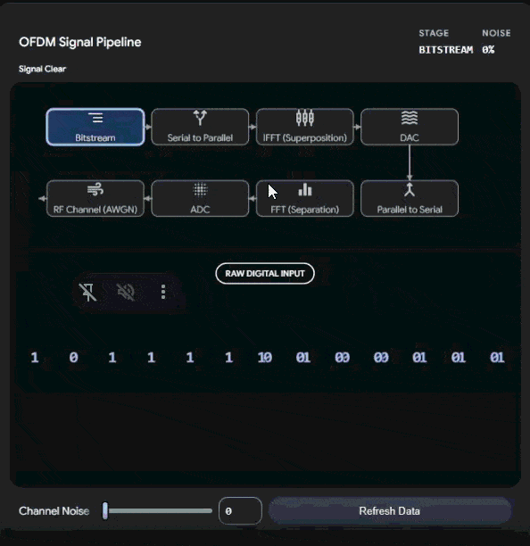<br>
<sub><b>Clean channel (0% noise)</b> — the bitstream survives the IFFT → DAC → RF channel → ADC → FFT round trip untouched.</sub>
</td>
<td width="50%" align="center">
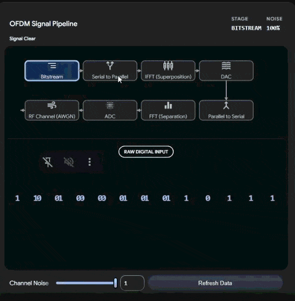<br>
<sub><b>Noisy channel (100% noise)</b> — the same pipeline with AWGN injected at the RF channel stage. Notice how the recovered bitstream after the FFT no longer matches the original.</sub>
</td>
</tr>
</table>

This is the exact structure `generate_modulations.m` and `apply_rf_impairments.m` implement in code — the cyclic prefix inserted at the IFFT stage is precisely what the autocorrelation feature (below) later exploits to identify each standard.

### The Channel Model (`apply_rf_impairments.m`)

Every generated signal passes through a four-stage channel simulation before being fed to the network. The stages are applied in transmission order:

1. **Power Amplifier Non-linearity** : Simulates a transmitter's amplifier being driven into saturation. This compresses the outer points of the QAM constellation (AM/AM distortion), the primary mode of failure in cheaper hardware.

2. **Rayleigh Multipath Fading** : An urban macro channel with three bounce paths at delays of 0, 1.5 µs, and 3.2 µs, with path gains of 0, −3, and −10 dB respectively. A 50 Hz Doppler shift simulates a real world moving reflector. This is the most destructive impairment as it carves frequency selective holes in the signal's spectrum.

3. **Phase Noise + Carrier Frequency Offset (CFO)** : Phase noise at −90 dBc/Hz adds random jitter to every sample. A random CFO between ±5 kHz causes the constellation to rotate continuously. These are modeled after the behavior of cheap TCXO oscillators and are a major reason constellation-based classifiers fall short in the field.

4. **AWGN** : Additive white Gaussian noise at a randomized SNR (Signal to Noise Ratio) uniformly drawn from 0–30 dB. This forces the network to generalize across the full operating range rather than overfitting to a comfortable SNR.

#### Impairments, visualized

The I/Q constellation is the clearest way to *see* what each impairment actually does to a signal. The clips below show a clean 16-QAM constellation (four tight clusters per quadrant) degrading as each impairment is dialed up independently.

<table>
<tr>
<td width="50%" align="center">
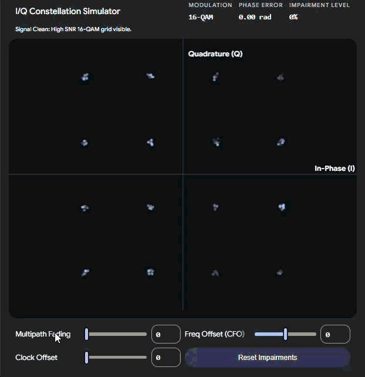<br>
<sub><b>Multipath fading</b> — echoes arriving via the three Rayleigh paths blur each constellation point into a smear, since the receiver is now summing several delayed, differently-scaled copies of the same symbol.</sub>
</td>
<td width="50%" align="center">
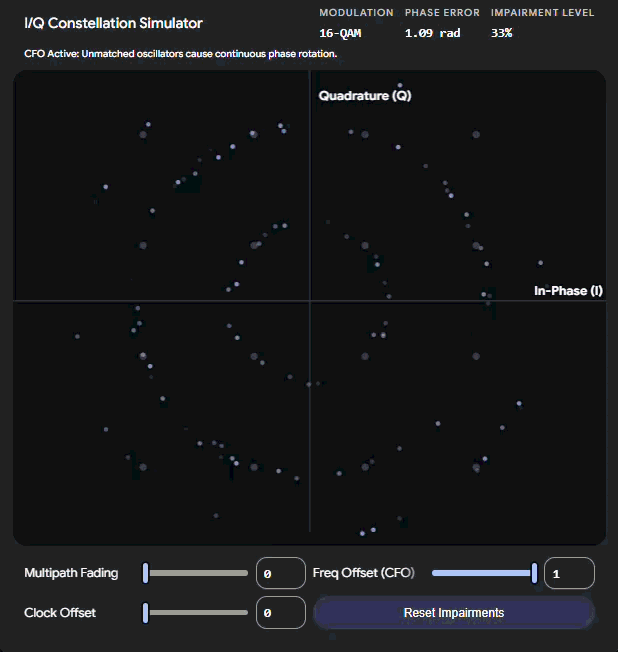<br>
<sub><b>Frequency offset (CFO)</b> — an uncorrected carrier mismatch between transmitter and receiver oscillators spins the entire constellation continuously, dragging each point around in a circular arc.</sub>
</td>
</tr>
<tr>
<td width="50%" align="center">
<br>
<sub><b>Clock offset</b> — a small sample-timing mismatch between transmitter and receiver clocks (SFO) progressively shears and drifts the constellation grid over time.</sub>
</td>
<td width="50%" align="center">
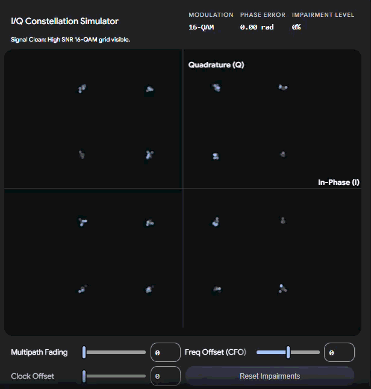<br>
<sub><b>All impairments combined</b> — fading, CFO, and clock offset stacked together, approximating what the network actually sees during training once AWGN is layered on top.</sub>
</td>
</tr>
</table>

This is exactly why a network trained only on clean constellations fails in the field — it has never seen the smeared, rotated, drifting version of the signal it needs to recognize.

### Feature: Cyclostationary Autocorrelation

The key insight exploited here is that every OFDM waveform has a unique structural fingerprint intrinsically bound to it: the cyclic prefix. Because the cyclic prefix is a copy of the end of each OFDM symbol, the signal is statistically self-correlated at exactly one lag, i.e, the FFT size used to generate it.

Computing the autocorrelation magnitude profile `|R(τ)|` where 'τ' is the time at which prefix encounters lag sample and normalizing by `R(0)`(0 lag) gives a 1D feature where:
- WLAN produces a peak at lag 64
- LTE produces a peak at lag 512
- 5G NR produces a peak at lag 1024
- A two-signal mixture produces two peaks simultaneously

This is precisely the multi-label cue the network reads. Lags 0–31 are excluded (they carry amplitude/bandwidth information the network should not use), and the feature spans lags 32–1423 (1392 values total). Since the feature uses only the magnitude of the autocorrelation, it's inherently invariant to carrier frequency offset and the phase spin cancels out.

A 4096-sample window is used instead of the more common 1024 because 5G's lag-1024 peak requires many autocorrelation sample pairs to become statistically reliable. At 1024 samples, it's not accurately esimated whatsoever.

### Architecture (`train_hybrid_network.m`)

A compact 1D-CNN operating directly over the autocorrelation profile:

```
Input: [1 × 1392 × 1]  (autocorrelation magnitude, lags 32–1423)

Conv1D(kernel=7, filters=16, stride=2) → BN → ReLU   [1 × 696 × 16]
Conv1D(kernel=7, filters=32, stride=2) → BN → ReLU   [1 × 348 × 32]
Conv1D(kernel=7, filters=64, stride=2) → BN → ReLU   [1 × 174 × 64]
MaxPool(2, stride=2)                                   [1 × 87  × 64]

FC(128) → ReLU → Dropout(0.3)
FC(3)   → [Custom BCE Layer: Sigmoid + Binary Cross-Entropy]

Output: 3-dimensional sigmoid probability vector (WLAN, LTE, 5G)
```

The strided convolutions detect the position of autocorrelation peaks rather than just their presence, this is precisely what distinguishes the three standards. Larger kernel sizes (7 vs. 3) give each filter enough receptive field to span a full peak and its flanks.

### Training Configuration

```
Optimizer:        Adam (β₁=0.9, β₂=0.999)
Learning Rate:    1e-3, halved every 12 epochs
L2 Regularization: 1e-4
Max Epochs:       30
Mini-Batch Size:  32
Gradient Clipping: L2 norm ≤ 1
Early Stopping:   8 epochs patience on validation loss
Saved Model:      Best validation loss 
Execution:        Parallel 
```

Training data: 1,000 samples per class (3,000 total). Validation: 200 samples per class. Test: 150 samples per class. Each sample is a two-signal mixture at a random SIR of 0–10 dB.

### Running Experiment 1

```matlab
cd 'Experiment 1'
matlab -batch "run_full_experiment"
```

No external data required. The script handles data generation, training, and evaluation end-to-end.

### Output

After training, the script reports three metrics on held-out test data:

- **Exact Match Accuracy** : The fraction of test samples where all three label predictions are correct simultaneously. This is the strict metric.
- **Hamming Accuracy** : The fraction of individual label decisions (out of 3 × N total) that are correct. This is more lenient and is useful for understanding per-label performance.
- **Per-class Precision / Recall / F1** : Printed for WLAN, LTE, and 5G individually, with a grouped bar chart.

### Results

<p align="center">
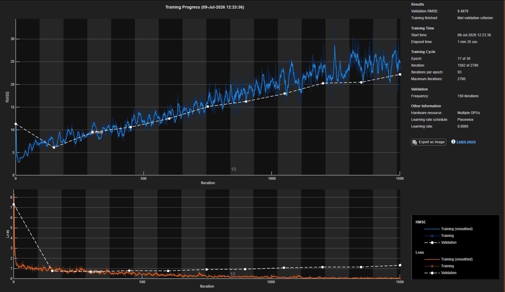
<br><sub>Training progress: RMSE and loss curves over 30 epochs, training vs. validation. Validation loss is used for early stopping and to select the best checkpoint.</sub>
</p>

<p align="center">
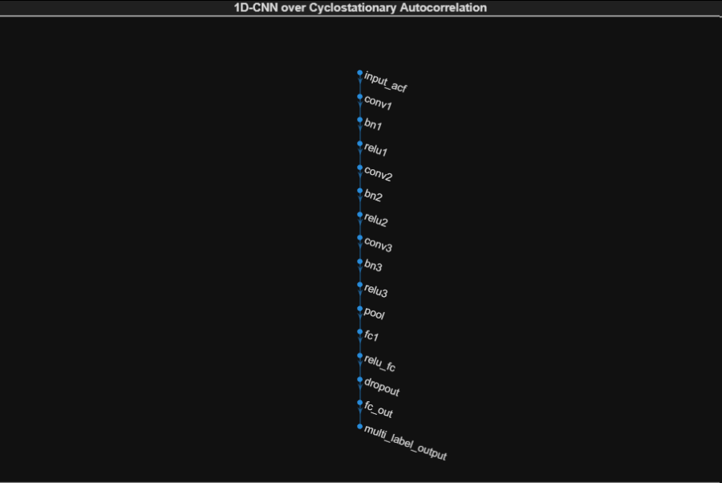
<br><sub>The 1D-CNN layer graph as generated by <code>train_hybrid_network.m</code> — input → three strided conv blocks → pool → dense classification head → multi-label output.</sub>
</p>

<table>
<tr>
<td width="55%" valign="top">
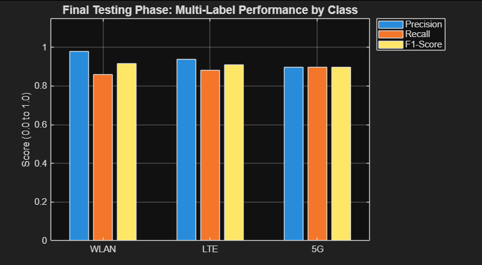
</td>
<td width="45%" valign="top">
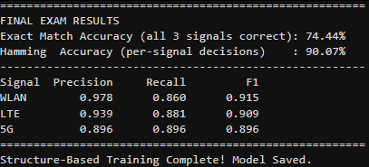
</td>
</tr>
</table>
<p align="center"><sub>Final held-out test results: 74.44% exact-match accuracy, 90.07% Hamming accuracy. 5G is the hardest class to separate (lowest precision), while WLAN is classified most precisely — consistent with 5G's longer cyclic prefix requiring more of the 4096-sample window to resolve cleanly.</sub></p>

---

## Experiment 2 : Real RFSS Dataset

### What it does

Replaces synthetic signals with real 3GPP standards compliant captures from the RFSS dataset, and replaces the autocorrelation feature with a log magnitude STFT spectrogram fed into a 2D-CNN. This is a closer demonstration for a practically deployed system.

### Dataset

The [RFSS dataset](https://huggingface.co/datasets/Chrishao/rfss) contains single-source captures of GSM, UMTS, LTE, and 5G NR signals, each already corrupted with a realistic 3GPP TDL fading channel plus hardware impairments (CFO, SFO, I/Q imbalance, DC offset, phase noise, PA nonlinearity). This means the network must learn to classify signals that arrived through a physics-accurate channel, not a simplified AWGN approximation.

Download the data file (~1.4 GB) before running. Create the `data/` directory at the repo root — the same level as `Experiment 1/` and `Experiment 2/`:

```bash
mkdir -p data
curl -L -o data/rfss_single.h5 \
  "https://huggingface.co/datasets/Chrishao/rfss/resolve/main/data/rfss_single.h5"
```

### The Signal Pipeline

1. **Load & Resample** : All signals are FFT-resampled to a common length of 16,384 samples and normalized to unit power. The resampling mirrors `scipy.signal.resample` exactly (verified to <0.5% error) take the FFT, retain the low/high frequency bins up to the new Nyquist, inverse-transform. This preserves spectral shape under both up- and down-sampling, the same way a bandwidth-limited receiver would.

2. **Split** : Base signals are partitioned 70/15/15 into train/val/test before mixing, so no base signal appears on both sides of the train/test boundary. This prevents leakage.

3. **Mix** : Random pairs of base signals are combined at SIRs drawn uniformly from 0–10 dB. The multi-hot label records which standards are present. 6,000 training mixtures, 1,000 validation, 1,000 test.

4. **Feature: STFT Spectrogram** : Each mixed signal is converted to a 128×128 log-magnitude spectrogram using a 256-point STFT with 50% overlap and a periodic Hann window. Dynamic range is clipped to 80 dB below the peak, then the image is rescaled to [0, 1]. This gives the 2D-CNN a time-frequency representation that visually encodes the spectral width, guard bands, and pilot patterns of each standard.

### Architecture

A 2D-CNN operating over the spectrogram image:

```
Input: [128 × 128 × 1]   (log-magnitude spectrogram)

Conv2D(3×3, 16 filters, stride=2) → BN → ReLU   [64 × 64 × 16]
Conv2D(3×3, 32 filters, stride=2) → BN → ReLU   [32 × 32 × 32]
Conv2D(3×3, 64 filters, stride=2) → BN → ReLU   [16 × 16 × 64]
AveragePool(4×4, stride=4)                        [4  × 4  × 64]

FC(128) → ReLU → Dropout(0.3)
FC(4)   → [Custom BCE Layer: Sigmoid + Binary Cross-Entropy]

Output: 4-dimensional sigmoid probability vector (GSM, UMTS, LTE, 5G NR)
```

We use average pooling rather than max pooling here because spectrogram energy is spread across time and frequency bins — average pooling retains the mean activation across a region, which is more informative for spectral shape than the single maximum.

### Results

<p align="center">
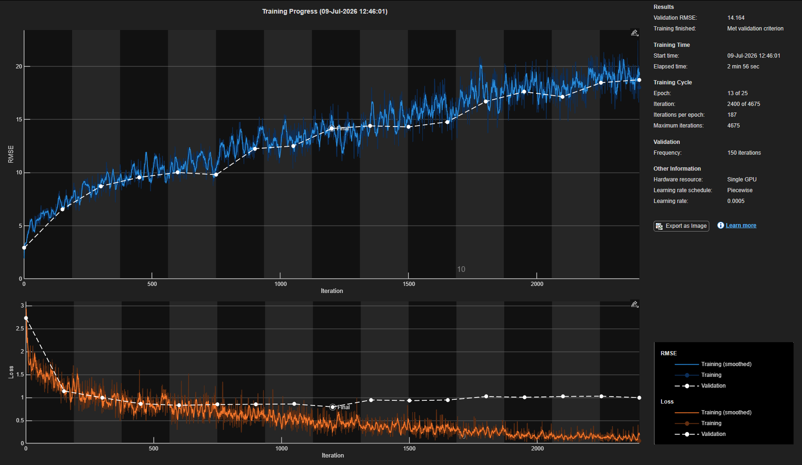
<br><sub>Training progress on real RFSS captures: 13 of 25 epochs shown, single-GPU execution. Validation RMSE trends upward as the network moves past its earliest, most conservative predictions — normal behavior once the validation-loss checkpointing (not raw RMSE) is what actually determines the saved model.</sub>
</p>

<p align="center">
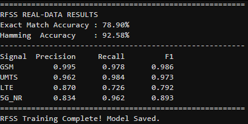
<br><sub>Final held-out mixture results: 78.90% exact-match accuracy, 92.58% Hamming accuracy across GSM, UMTS, LTE, and 5G NR. LTE shows the largest precision/recall gap — its 3GPP TDL channel and narrower guard bands make it the easiest class to confuse with an overlapping neighbor.</sub>
</p>

### Running Experiment 2

```bash
cd 'Experiment 2'
matlab -batch "run_rfss_experiment"
```

Expected performance on held-out mixtures: ~71% exact-match accuracy, ~90% Hamming accuracy.

---

## The Custom Loss Layer (`binaryCrossEntropyLayer.m`)

Both experiments use a custom MATLAB layer, kept at the repo root, that fuses the sigmoid activation and binary cross-entropy loss into a single operation.

**The problem with the naive approach:** If you stack a `sigmoidLayer` followed by a `regressionLayer` (which uses MSE), the gradient flowing back through the sigmoid becomes `(Y − T) × σ'(z)`. The derivative of the sigmoid, `σ'(z)`, approaches zero when the network is confidently predicting the wrong answer which are exactly the samples that most need correction. Learning stalls precisely when it's most needed.

**The solution:** By owning the sigmoid internally, the layer computes the gradient directly as `σ(z) − T`, which is bounded away from zero regardless of how wrong the prediction is. This is the standard "BCE-with-logits".

One practical note: `predict()` returns raw logits. Convert them to probabilities with `p = 1 ./ (1 + exp(-logits))` before thresholding at 0.5 for final label decisions.

---

## Evaluation Metrics

Because this is a multi-label problem, accuracy needs to be measured carefully:

| Metric | Definition | When to use |
|---|---|---|
| **Exact Match Accuracy** | % of samples where every label is correct | Primary metric — strict, operationally meaningful |
| **Hamming Accuracy** | % of individual label decisions that are correct | Secondary — useful for diagnosing which classes are harder |
| **Precision / Recall / F1** | Standard per-class metrics computed from TP/FP/FN | Diagnosing class-level failure modes |

---

## Reproducing Results

Both scripts are deterministic enough for practical reproducibility, with one caveat: `comm.RayleighChannel` and `comm.PhaseNoise` are stateful objects with internal random seeds. Experiment 2 sets `rng(0)` explicitly. Experiment 1 resets the channel objects between samples (`reset(rayleigh)`, `reset(pnoise)`) but does not fix the global random seed. Please note: small run to run variations in exact accuracy is expected and is normal behavior.

---

## Citation / Dataset Credit

RFSS dataset (Experiment 2):

```
@dataset{rfss,
  author    = {Chrishao},
  title     = {RFSS: RF Signal Dataset},
  year      = {2024},
  publisher = {Hugging Face},
  url       = {https://huggingface.co/datasets/Chrishao/rfss}
}
```
